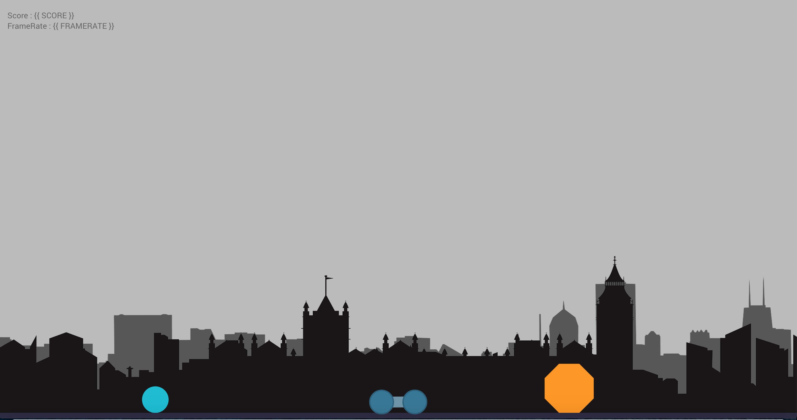

# Rider

This is a simple Rider game build on top of [Matter.js](https://github.com/liabru/matter-js) Physic Engine.  
A demo is playable at this [adress](https://d0rianb.github.io/Rider/.) .

The controls are :
 - **SPACE** : Move Forward
 - **MAJ + SPACE** : Move Backward
 - **ENTER** : Generate Triangle
 - **LEFT ARROW** : Rotate Left
 - **RIGHT ARROW** : Rotate Right
 - **Q, D** : Move Camera Horizontally (just at the beginning)
 - **Z, S** : Move Camera Vertically
 - **P, M** : Zoom / Dezoom Camera
 - **R** : Reset View
 - **H** : Display Help
 - **B** : Debug Mode
